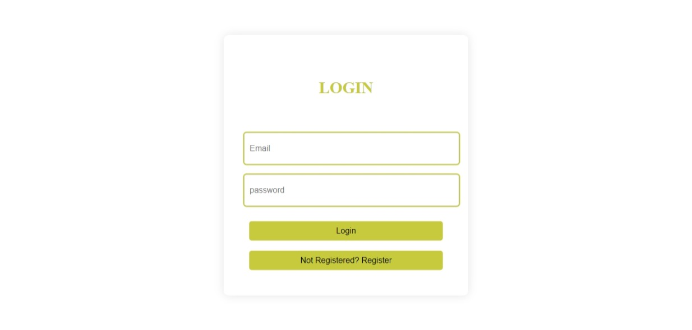
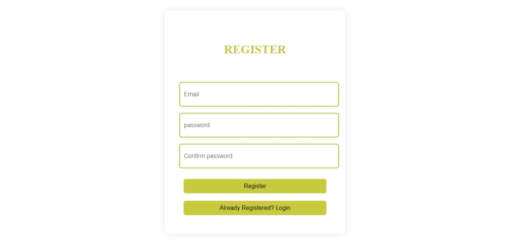
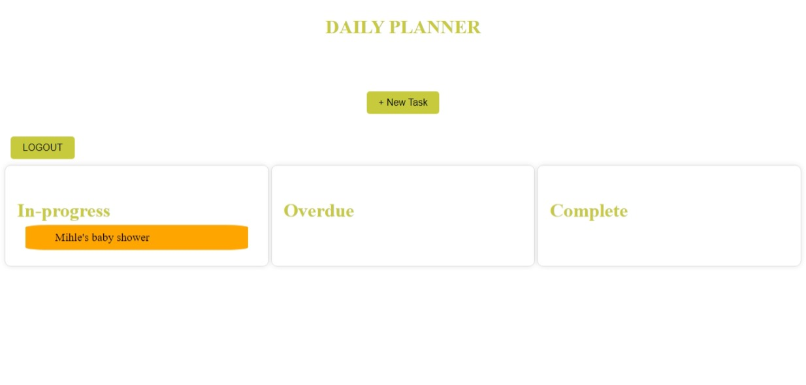
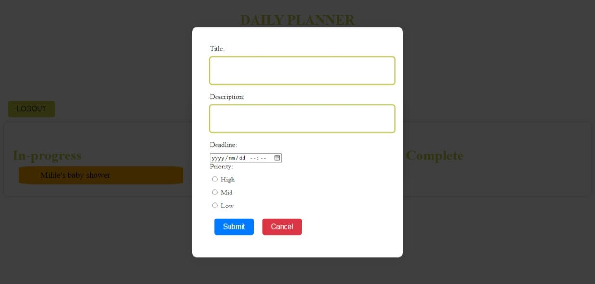

# To-Do-List

## Deployment URL
* [https://to-do-list-alpha-eight-10.vercel.app/)

This project was generated with [Angular CLI](https://github.com/angular/angular-cli) version 18.2.1.

## Overview

Welcome to the To-Do List (Daily Planner), a task management tool designed to help you organize your daily activities. This application features user authentication, allowing users to register and log in, and provides a dashboard to view tasks categorized by their progress: In-Progress, Complete, or Overdue.

## Features

- **Login Page**: Secure access for users to manage their tasks.
- **Register Page**: Create a new account to start managing tasks.
- **Dashboard**: View tasks categorized by progress status (In-Progress, Complete, Overdue).
- **Add Task**: Easily add new tasks to your to-do list.

## Technologies Used

- Built with Angular framework for the frontend.
- Node.js for the backend.

## Getting Started

To run this application locally, follow these steps:

### Prerequisites

- Make sure you have [Node.js](https://nodejs.org/) installed on your machine.
- Install Angular CLI globally if you haven't already:
  ```bash
  npm install -g @angular/cli


## Running backend
- Nagivate to the backend directory
     cd To-Do-List/src/app/backend
- Start the backend server
    node index.js


## Running frontend
- Open a new terminal and navigate to the angular project
    cd To/Do/List (note this will depend on your folder structure)
- Start the frontend application 
    ng serve

## Running Both Servers Concurrently
- Make sure to run both the backend and frontend servers concurrently to enable full functionality of the application.
    Open your browser at http://localhost:4200 to access the application.

## Screenshots

- **Login Page**
    

- **Register Page**
    

- **Dashboad**
    

- **Add Task**
    


## Further Help
- To get more help on the Angular CLI use `ng help` or go check out the [Angular CLI Overview and Command Reference](https://angular.dev/tools/cli) page.


